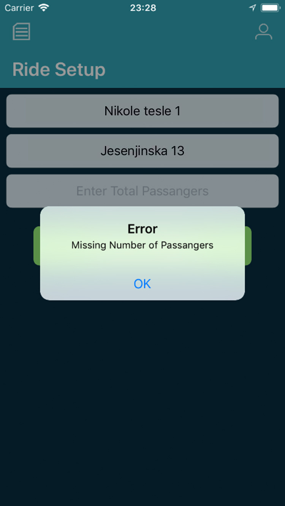
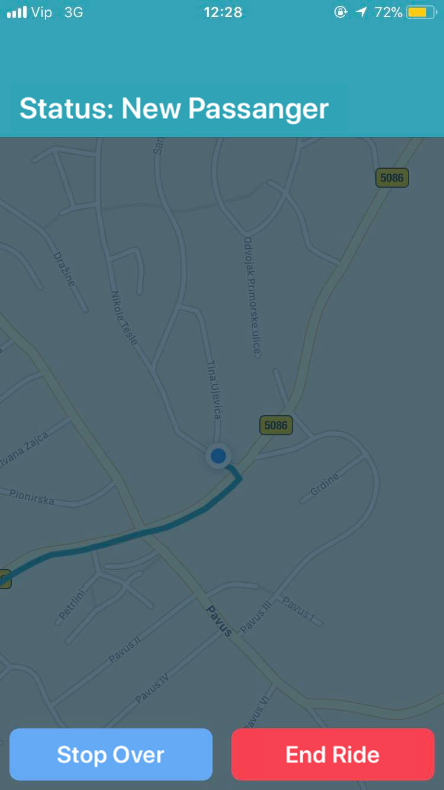
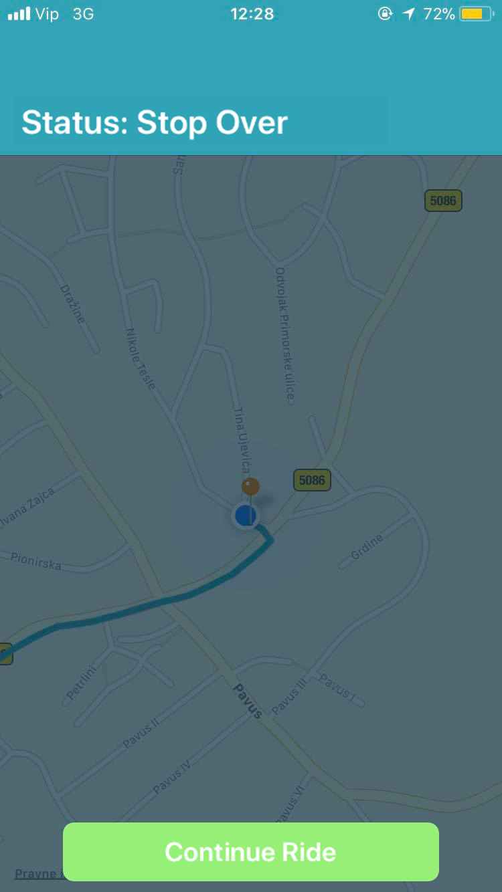
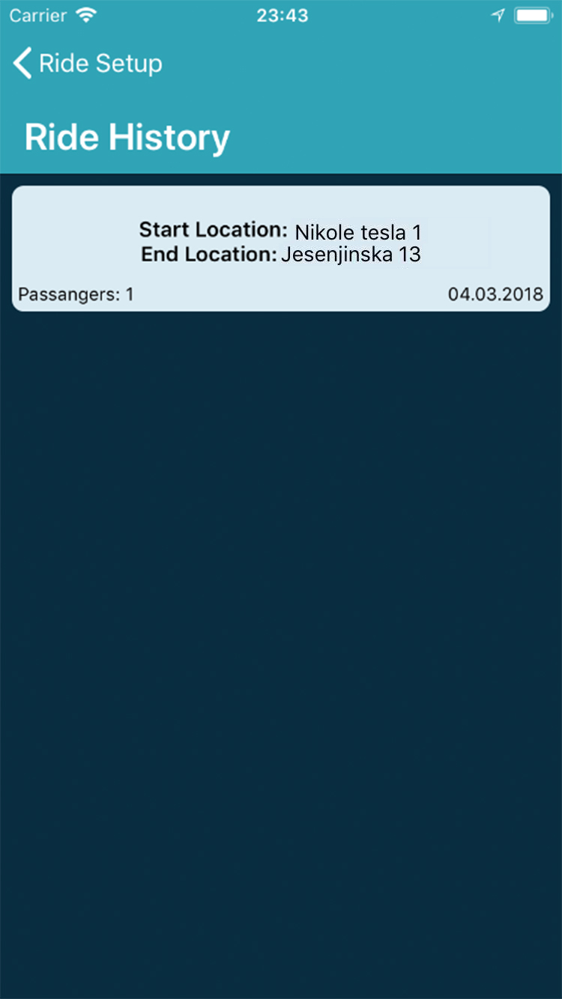

# PickMe
Taxi Navigation App focused on collecting GPS and workflowaction data from current driver. Driver needs to enter start, end location and total passengers to start ride. While in ride mode you can pick passangers and send coresponding data to server about your work. All data is saved localy so you are able to see it later and exeminate.

GPS data represents latitude/longitude for current position, date and id. On the other hand workflow actions data represents the current state of driver (driving/picking passangers/ stoping over/ continue ride and ending ride). All GPS data is stored locally and on server.

# App workflow
## Raid Setup

When entering app first will show Ride Setup View. This view shows three text Fields which needs to be filled. If one of the fields is missing corresponding error will be showen to user. On the other hand if everything is correct button for ride start will be enabled and the ride can start.

Fields to enter: 
- Enter start position
- Enter end location
- Enter total passengers 

    

 ## Current Raid 
 
 After all data needed to enter ride was entered the ride starts. If web connection is available user location and drive path will be shown on map. Driver can use few options showed in the next list by pressing simple buttons.
 
 Main acctions in this view:
 - passanger picked up
 - stop over
 - continue ride 
 - raid over 
 
 When picking passengers user can stop over to pick him or end ride. When stopping over he is able to continue ride. For every picked passenger an orange pin will be shown on map. All this actions are sended to server and all GPS data is collected with period of 8 sec. All GPS data is saved locally if user doesnt have web connection so later he can resend it.

    

## Ride History

In the Ride setup View two options are available to be shown, users Ride history and user profile. Ride history can be entered while tapping left bar button on navigation controller, while Driver profile is available with right bar button.

In Ride history view is show a list of past Rides ordered by date. Some basic information is shown by every element on that list. While tapping on one element new view will show with detailed information about that ride and with shown map with annotations (start, end and passengers pins). 

All rides can be deleted by swiping to the left on specific element on list. Main feature of this view is to check data in database and send it to server if it is needed.

    
 
 ## Driver Profile
 
This view shows basic driver data like name, age, car registration and driver picked image. 

  

# Main Features:
- CoreLocation, tracking GPS location of user
- Sending data of location and workflow actions to server
- Background tracking user location
- CoreData, persistent storage of ride details
- AutoLayout with code
- Localization (English, Croatian)

